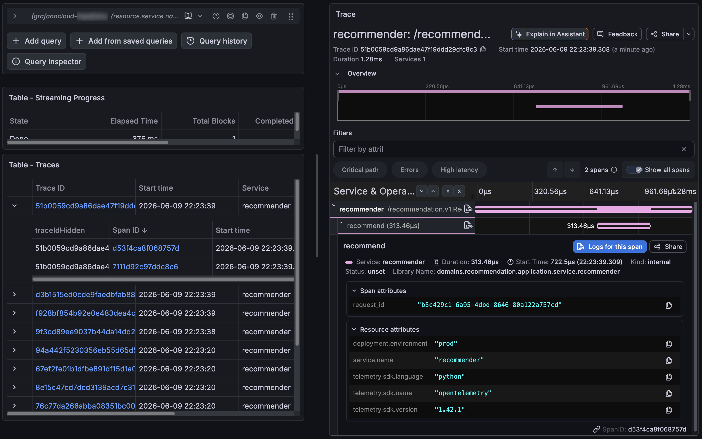

# Recommendation Service (MLOps Test Task)

[English](README.md) | **Русский**

gRPC-сервис: принимает историю взаимодействий пользователя (список `item_id`) и возвращает список рекомендованных `item_id`. Инференс выполняется на модели в формате ONNX

Сервис развёрнут и доступен по публичному gRPC-endpoint - адрес и токен приложены к сообщению со сдачей задания

---------

## 1. Quick Start (local)

Нужен только Docker с Docker Compose

```bash
cp .env.template .env   # дефолтов достаточно для локального запуска
make rebuild            # сборка образа и запуск; сервис слушает 127.0.0.1:50051
```

Как вызвать метод и проверить ответ - [раздел 2](#2-verify)

---------

## 2. Verify

Самый быстрый способ - smoke-тест клиент ([`scripts/smoke_test.py`](scripts/smoke_test.py)), он шлёт несколько примеров историй, валидирует ответы и печатает рекомендации

Проверка живого сервиса (адрес и токен из сообщения со сдачей):

```bash
make smoke-test ADDRESS=<host>:50051 TOKEN=<token>
```

Локально, против поднятого контейнера (токен берётся из `.env`):

```bash
make smoke-test
```

Это тот же скрипт, что гоняется в CI ([`smoke-test.yml`](.github/workflows/smoke-test.yml))

Дёрнуть метод вручную можно любым gRPC-клиентом. Сервис отдаёт server reflection и health-check, поэтому `grpcurl` работает без proto-файлов:

```bash
grpcurl -plaintext -H "authorization: Bearer <token>" \
  -d '{"item_ids": [1, 67, 100]}' \
  <host>:50051 recommendation.v1.RecommenderService/Recommend
```

Авторизация - метаданные `authorization: Bearer <token>`
Полный путь метода - `/recommendation.v1.RecommenderService/Recommend` (про имя `RecommenderService` см. [раздел 3.5](#35-grpc-contract))

---------

## 3. Architecture

### 3.1 Project Layout

Карта репозитория, значимые директории:

```
.
├── api/proto/recommendation/v1/recommendation.proto  # gRPC-контракт (Buf)
├── scripts/
│   ├── export_model.py         # PyTorch > ONNX: экспорт + сверка выходов
│   └── smoke_test.py           # gRPC-клиент (локально и в CI)
├── models/model.onnx           # экспортированная модель, запекается в образ
├── src/
│   ├── command/                # composition root: конфиг, DI, сервер, логгер
│   │   └── grpc_server/        # entrypoint, auth-интерсептор, DI-контейнер
│   ├── domains/recommendation/ # гексагональное ядро
│   │   ├── domain/             # ItemId, ошибки (без зависимостей)
│   │   ├── application/        # порты (Recommender, Predictor) + сервис
│   │   └── adapter/            # input/grpc_recommender, output/onnx_predictor
│   ├── telemetry/              # настройка OpenTelemetry-трейсинга
│   └── grpc_proto/             # сгенерированные stubs (Buf), отдельный import-root
├── test/unit/                  # юнит-тесты по всем слоям
├── Dockerfile                  # multi-stage, dev/CI/prod через WITH_DEV
├── docker-compose.yml          # локальная разработка (биндит 127.0.0.1)
├── docker-compose.prod.yml     # VPS (OTLP>Grafana, биндит 0.0.0.0)
├── Makefile                    # make-цели поверх docker compose (см. make help)
└── .github/workflows/          # ci-cd.yml, smoke-test.yml
```

### 3.2 Hexagonal Layers

Гексагональная архитектура, зависимости направлены внутрь, к ядру:

- **`domain`** - бизнесовые типы и ошибки, без внешних зависимостей ([`ItemId`](src/domains/recommendation/domain/types.py), [`ItemIdOutOfRangeError`](src/domains/recommendation/domain/errors.py))
- **`application`** - порты [`Recommender`](src/domains/recommendation/application/port/input/recommender.py) (вход) и [`Predictor`](src/domains/recommendation/application/port/output/predictor.py) (выход) плюс сервис [`RecommenderService`](src/domains/recommendation/application/service/recommender.py) с бизнес-логикой поверх портов
- **`adapter`** - реализации портов: [`GrpcRecommender`](src/domains/recommendation/adapter/input/grpc_recommender.py) на входе и [`ONNXPredictor`](src/domains/recommendation/adapter/output/onnx_predictor.py) на выходе
- **`command`** - composition root: конфигурация, DI-контейнер ([`container.py`](src/command/grpc_server/container.py)), запуск сервера, логгер

Ядро не знает ни про gRPC, ни про ONNX и зависит только от портов. Поэтому транспорт и модель подменяемы без правок бизнес-логики, а каждый слой тестируется изолированно: соседи-порты подменяются mock-объектами

### 3.3 Model Lifecycle

PyTorch-модель экспортируется в ONNX скриптом [`scripts/export_model.py`](scripts/export_model.py) (`make export-model`); в рантайме сервис работает только с `.onnx`

Что важно в экспорте:

- **Эмбеддинги через `register_buffer`.** В исходном классе матрица эмбеддингов - обычный атрибут (`torch.rand(...)`), такой тензор не считается состоянием модуля и не попал бы в граф ONNX. Регистрация буфером вшивает веса в граф
- **Переменная длина истории.** `dynamic_axes` делает ось истории динамической, поэтому одна модель принимает вход любой длины (opset 17)
- **Размер словаря едет вместе с моделью.** Число items пишется в метаданные ONNX-файла (`num_items`) и читается [`ONNXPredictor`](src/domains/recommendation/adapter/output/onnx_predictor.py) при загрузке для валидации диапазона `item_id`. Vocab не захардкожен в сервисе: переобучили модель с другим словарём - сервис подхватит новое значение без правок кода
- **Сверка с эталоном.** После экспорта `verify()` прогоняет один вход через PyTorch и ONNX Runtime и сверяет выходы

Готовый [`models/model.onnx`](models/model.onnx) запекается в Docker-образ и грузится один раз при старте как DI-синглтон; путь задаётся через `MODEL_PATH`

### 3.4 Request Flow

Сервер - `grpc.aio`. Путь одного запроса:

```
RPC > tracing-интерсептор > auth-интерсептор > GrpcRecommender > RecommenderService > ONNXPredictor
```

- **Авторизация** ([`auth.py`](src/command/grpc_server/auth.py)): интерсептор сверяет bearer-токен в constant-time (`hmac.compare_digest`); health-check методы проходят без токена
- **`request_id`**: [`GrpcRecommender`](src/domains/recommendation/adapter/input/grpc_recommender.py) берёт его из `x-request-id` либо генерирует и привязывает к логам и span - сквозной ключ корреляции
- **Пустая история**: `mean` по пустому тензору дал бы `nan`, поэтому пустой вход короткозамыкается в `[]` ещё в сервисе, без обращения к модели
- **Инференс не блокирует loop**: CPU-bound `session.run` уезжает в пул через `asyncio.to_thread`
- **Коды ошибок**: входной `item_id` вне словаря - `INVALID_ARGUMENT`, прочие сбои - `INTERNAL`

### 3.5 gRPC Contract

Контракт лежит в [`recommendation.proto`](api/proto/recommendation/v1/recommendation.proto). Python-stubs генерирует Buf:

```bash
make proto-gen
```

Сгенерированный код пишется в `src/grpc_proto`: он отделён от рукописного и подключается отдельным import-root через `PYTHONPATH`

> **Обратите внимание:** Я назвал сервис `RecommenderService`, хотя в задании `Recommender`: Buf STANDARD lint требует суффикс `Service`. Это осознанное отступление от контракта из задания, клиенты зовут метод как `recommendation.v1.RecommenderService/Recommend`

### 3.6 Configuration

Все настройки берутся из переменных окружения ([`configuration.py`](src/command/configuration.py), pydantic-settings):

- `GRPC_PORT`, `MODEL_PATH`, `ONNX_PROVIDERS`
- семейство `OTEL_*`
- `GRPC_TOKEN` - `SecretStr`, обязателен (без него сервис не стартует)

Для локального запуска хватает дефолтов из [`.env.template`](.env.template)

---------

## 4. CI/CD

В [`.github/workflows`](.github/workflows) два пайплайна:

**[`ci-cd.yml`](.github/workflows/ci-cd.yml)** - основной, по событиям в `master`:

- **PR в `master`**: линт (`black`, `ruff`, `pyright`) и unit-тесты
- **push в `master`**: то же + сборка и публикация prod-образа в GHCR (теги: короткий SHA и `latest`), затем деплой на VPS - копирование [`docker-compose.prod.yml`](docker-compose.prod.yml) и `pull` + `up` по SSH
\
  Линт и тесты гоняются в том же Docker-образе ([`Dockerfile`](Dockerfile)), что и прод, только с `WITH_DEV=1` (dev-зависимости поверх общей базы) - то есть проверяется фактически та же сборка, что уезжает в прод

**[`smoke-test.yml`](.github/workflows/smoke-test.yml)** - ручной (`workflow_dispatch`): тянет `latest` из GHCR и гоняет smoke-клиент против публичного endpoint

Деплой и smoke-тест требуют заранее поднятой VPS и заданных секретов - см. [раздел 5](#5-vps-setup-and-secrets)

---------

## 5. VPS Setup and Secrets

**1. Run once on the server:**

```bash
curl -fsSL https://get.docker.com | sh
sudo usermod -aG docker $USER && newgrp docker

sudo mkdir -p /opt/recommender && sudo chown $USER:$USER /opt/recommender

sudo ufw allow 50051/tcp
```

**2. Add secrets** (GitHub: Settings > Secrets and variables > Actions):

| Секрет | Назначение |
|---|---|
| `GHCR_TOKEN` | PAT со scope `read:packages` (VPS тянет образы из GHCR) |
| `SSH_HOST` | IP или домен сервера |
| `SSH_USER` | SSH-пользователь |
| `SSH_PRIVATE_KEY` | приватный SSH-ключ для деплоя |
| `GRPC_TOKEN` | bearer-токен, который проверяет сервис |
| `OTEL_EXPORTER_OTLP_HEADERS` | OTLP-заголовок авторизации Grafana Cloud (`%20` оставить как есть) |

`GRPC_TOKEN` - single source of truth: пайплайн инъектит его в контейнер при деплое и переиспользует в smoke-воркфлоу; на сервере не хранится

Токенов для GHCR два: встроенный `GITHUB_TOKEN` пушит образ при сборке и протухает вместе с прогоном, а `GHCR_TOKEN` (PAT) нужен, чтобы VPS тянула образ позже - например, при рестарте

---------

## 6. Observability (Logging and Tracing)

Логи структурированные (loguru, [`logger.py`](src/command/logger.py)): в проде JSON, локально - человекочитаемый вывод. Каждый запрос получает `request_id` (из `x-request-id` либо сгенерированный), привязанный ко всем его лог-строкам; логируются вход (`history_size`), исход (`recommendation_count`) и отклонения/ошибки

Трейсинг - OpenTelemetry ([`tracing.py`](src/telemetry/tracing.py)). Каждый `Recommend` RPC даёт server-span, его длительность и gRPC-статус снимаются автоматически gRPC-интерсептором. Внутри - дочерний span `recommend` из application-сервиса: он отделяет тайминг самих рекомендаций от gRPC-оверхеда и несёт тот же `request_id`, что и логи. Это и есть ключ корреляции логов и трейсов

> **Замечание об архитектуре:** span `recommend` живёт в application-сервисе. Более строгое прочтение гексагоналки требовало бы держать OpenTelemetry вне ядра, как внешнюю зависимость. На практике трейсер, как и логгер, это ambient cross-cutting concern, поэтому инструментирование сервиса - осознанный прагматичный компромисс

Экспорт трейсов задаётся окружением, код приложения везде одинаков:

- local: `OTEL_TRACES_EXPORTER=console` - spans в stdout (`make logs`)
- prod: `otlp` - напрямую в Grafana Cloud по OTLP/HTTP



---------

## 7. Testing

**Unit-тесты** покрывают все слои - auth-интерсептор, gRPC-адаптер, ONNX-предиктор, application-сервис и телеметрию; гоняются в том же Docker-образе, что и сборка, в том числе в CI ([раздел 4](#4-cicd)):

```bash
make test-unit
```

**Smoke-тест** ([`scripts/smoke_test.py`](scripts/smoke_test.py)) - end-to-end проверка живого сервиса: шлёт набор историй (короткую, длинную, из одного элемента и пустую) и валидирует ответы. Команды локального, удалённого и CI-запуска - в [разделе 2](#2-verify)

---------

## 8. Development

Весь цикл идёт через Docker и Make ([`Makefile`](Makefile)), `make help` показывает все таргеты:

- контейнер: `rebuild`, `shell`, `logs`, `down`
- качество кода: `format`, `lint`, `test` (`black`, `ruff`, `pyright`, `pytest`)
- модель и proto: `export-model`, `proto-lint`, `proto-gen`

Исходники в dev-режиме примонтированы в контейнер, поэтому `format`/`lint`/`test` работают с текущим кодом без пересборки образа. Локальный `poetry install --with dev` нужен только для подсветки и проверки типов в IDE - для запуска сервиса он не нужен

---------

## 9. Possible Improvements and Scaling

Сервис намеренно держится в рамках задания. Вот некоторые направления развития:

- **Реестр и версионирование моделей.** Сейчас `.onnx` запекается в образ, то есть версия модели привязана к git SHA. Логичный шаг - вынести артефакт в реестр (MLflow Model Registry или S3 с тегом версии) и грузить по `MODEL_VERSION`, отвязав релиз модели от релиза кода. Зашитый в файл `num_items` - уже задел в сторону self-describing артефакта
- **A/B-тестирование через порт.** `Predictor` - это порт, поэтому A/B встраивается адаптером-роутером, расщепляющим трафик по хешу `request_id` между двумя версиями модели. Выбранный вариант проставляется атрибутом span и полем лога - механика та же, что у `request_id`, поэтому офлайн-атрибуция результатов почти бесплатна
- **Canary через оркестратор.** Постепенный rollout новой версии на уровне Kubernetes (доля реплик с новым образом), независимо от кода сервиса
- **Горизонтальное масштабирование.** Сервис stateless (модель read-only, грузится в каждый процесс), поэтому масштабируется N репликами за gRPC-aware балансировщиком. Health-check и reflection уже готовы под readiness/liveness-пробы
- **Масштаб каталога.** Сейчас рекомендации - полный `matmul + topk`, то есть O(N) по каталогу; на больших каталогах его заменит ANN-индекс (FAISS, ScaNN). Провайдеры ONNX вынесены в `ONNX_PROVIDERS`, так что переход на GPU или квантизованную модель - вопрос конфигурации
- **Метрики.** Сейчас есть логи и трейсы, но нет метрик - напрашивается Prometheus (RPS, латентность, доля ошибок) и алерты поверх них
